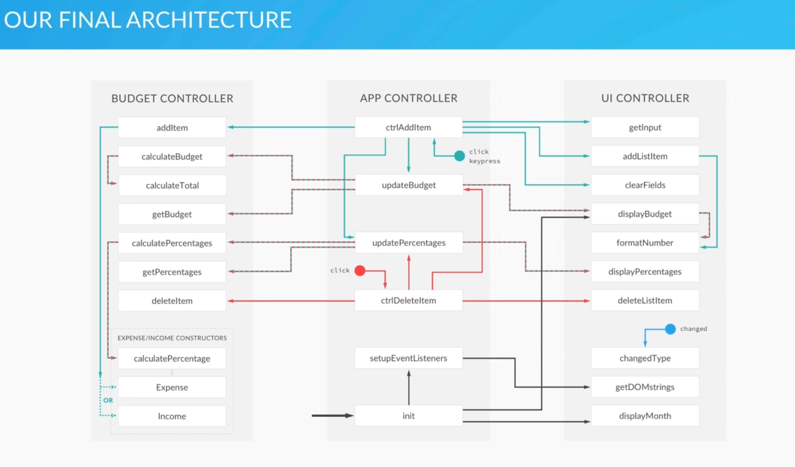

# budzetDomowy

## App made for Learning JS

Based on Udemy Course

> The Complete JavaScript Course 2019: Build Real Projects! by Jonas Schmedtmann
> [Link to udemy](https://www.udemy.com/course/the-complete-javascript-course/)

---

## Planning

### UI Module

- [ ] Get input values
- [ ] Add the new item to the UI
- [ ] Update UI with recalculated budget

### DATA Module

- [ ] Add the new item to data structure
- [ ] Calculate budget

### CONTROLLER Module

- [ ] Add event handler

